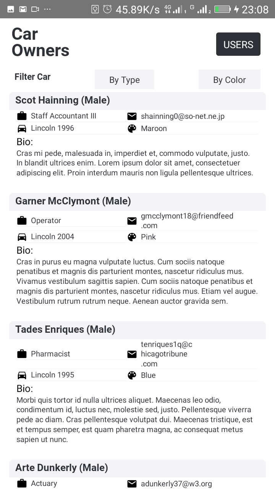
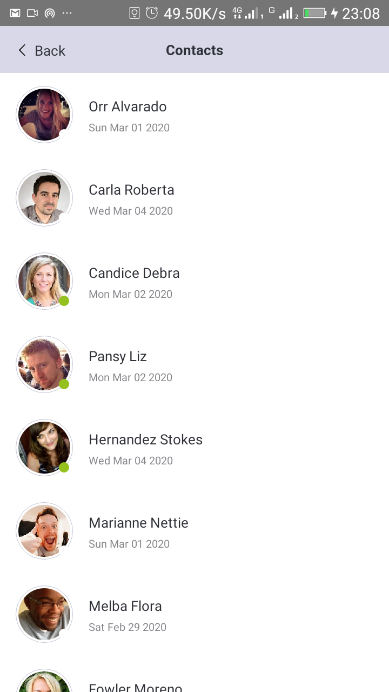
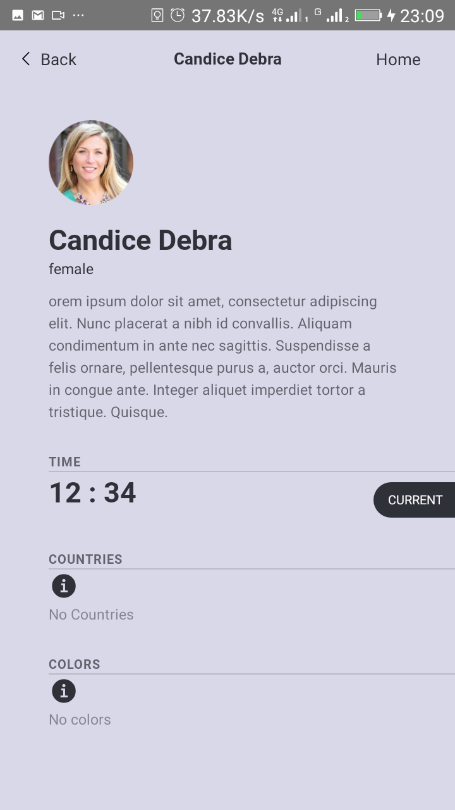
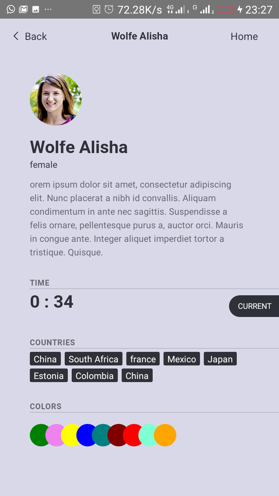
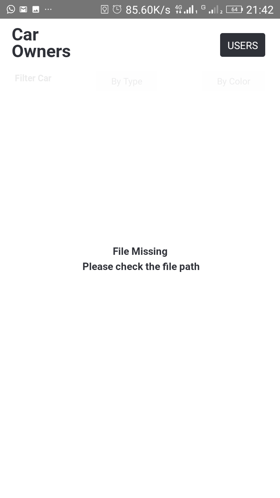

# decagon-challenge [](https://github.com/rajibola)


## Preview

<span>



 
 
 
</span>


### Follow this [link](https://drive.google.com/file/d/16CrNUh_ZPq3qh-9fPmt6Hbkd_cIyLYLl/view?usp=sharing) To preview the video demo of the app.
#### NB: The car_ownsers_data.csv file takes 10-15 minutes to load completely.

<br />

## Getting Started

1. Fork or Clone the repo, then set it up:

```
$ cd decagon-challenge
$ yarn install
```

### Run on Android

```
$ npx react-native run-android
```

### Run on iOS

```
$ cd ios && pod install
$ cd .. && npx react-native run-ios
```

## A brief description of the project
### Task
1. An excel file which contains the records of car owners in the United States over several years. You are to download this list and save it on your device in a folder called owners. Here is the link to download the file [link](https://drive.google.com/file/d/1giBv3pK6qbOPo0Y02H-wjT9ULPksfBCm/view).

2. A GET API which returns a list of users. Here is the link to the API endpoint [here](https://android-json-test-api.herokuapp.com/accounts).

3. Mockup: [PDF](https://drive.google.com/file/d/1mLnPoKO233kRh2aLeFv5DRKdp1qKm4-5/view?usp=sharing)

### Instructions
* Use any of the following (Java, Kotlin, Objective C, Swift, React Native, Flutter)
* If any mobile platform you wish to use is not listed above, please email info@decagonhq
* Your app should have at least three pages.
    * One to show cars and filter them using one or more criteria
    * The second showing the list of users fetched from the API
    * The third showing additional information about the user clicked
* Save the csv file locally on your device in a folder called owners.
Please do not rename the file or change the format. Handle cases for when this file is missing
* Design a master-detail esque view for the users returned by api.
* Handle errors gracefully
* Write tests
* Find a good user interface online which you can use. You can search on Dribble or Pinterest for ideas.

## Solution
1. Got the file path using `ExternalDirectoryPath` in `react-native-fs`.
2. Read the data in chuncks from the file path using `RNFetchBlob.fs.readStream` which takes in the path and the configuration.
3. Used `papaparse` to convert the result to an array which will be saved to the state.
4. Whilst step 1, 2, 3 are executing, the header is always available with a button to navigate to the `users` screen. And the process in step 1,2,3 is not interruped (i.e. the process does not wait or stop).
5. Navigate to `users` screen using the button to view list of users populated from the given API.
6. Navigate to `UserDetail` by pressing a user to show more details about the user.


## Technologies Used:
  * `react-native-fs`: used to get the external storage path to the owners/car_ownsers_data.csv.
  * `react-native-fetch-blob`: used to read the file from the path provided in streams.
  * `papaparse`: is used to convert the result from react-native-fetch-blob to an array.
  * `react-native-vector-icons`: is used to render the UI icons.
  * `jest` and `react-test-renderer`: is used for the unit testing.
    * To mock native components and functions
    * To render and check components and screens if they render correctly
    * To create snapshots of screens and components. And to compare them to their snapshot respectively.
* `react-navigation`: is used to navigate between screens.
